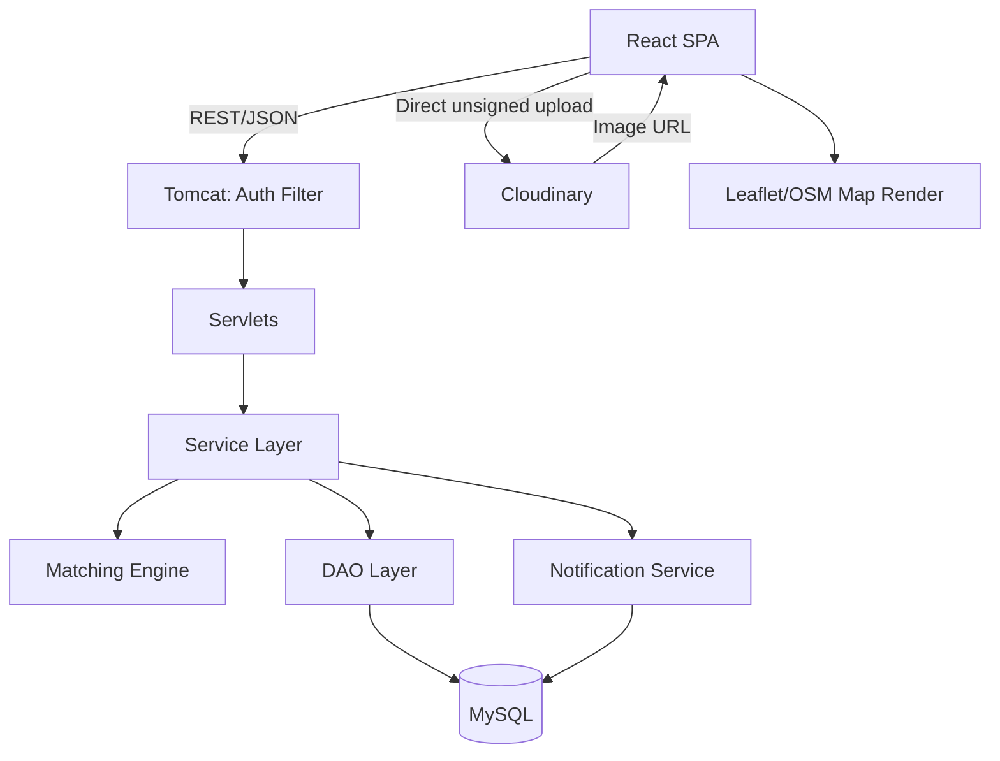
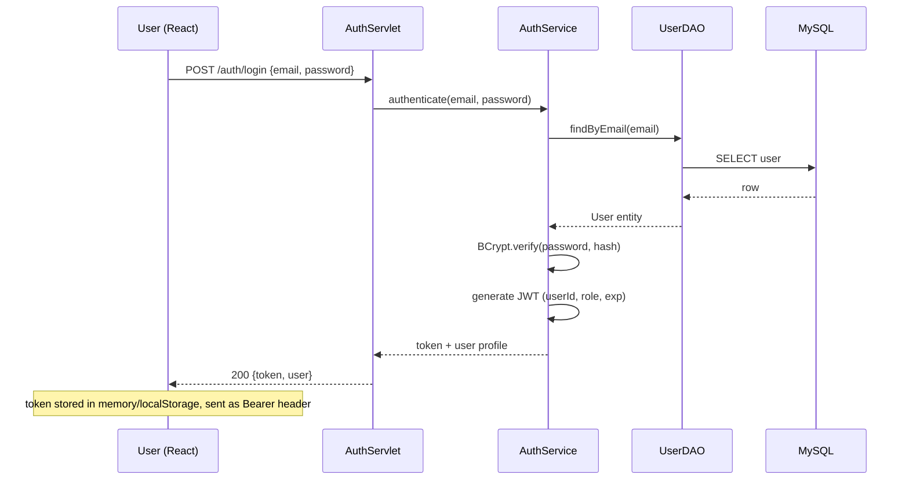
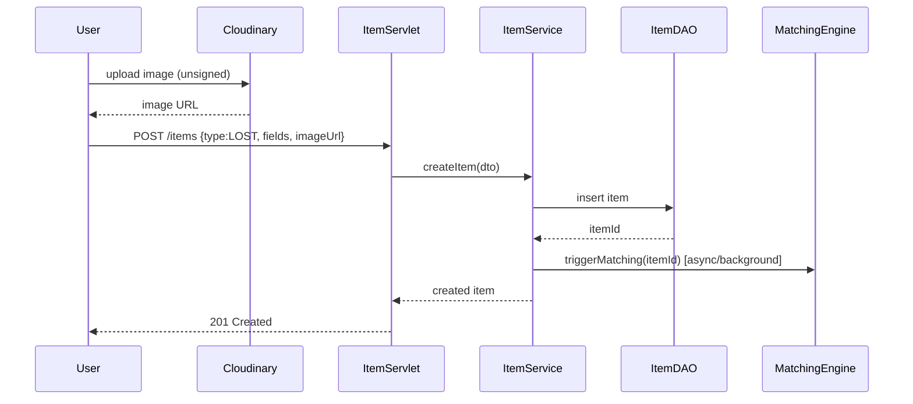
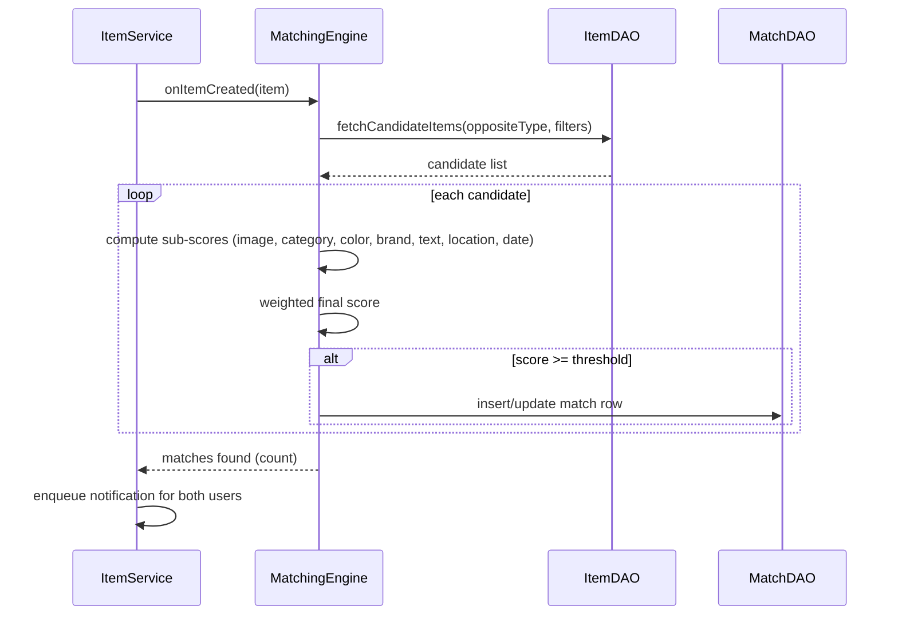
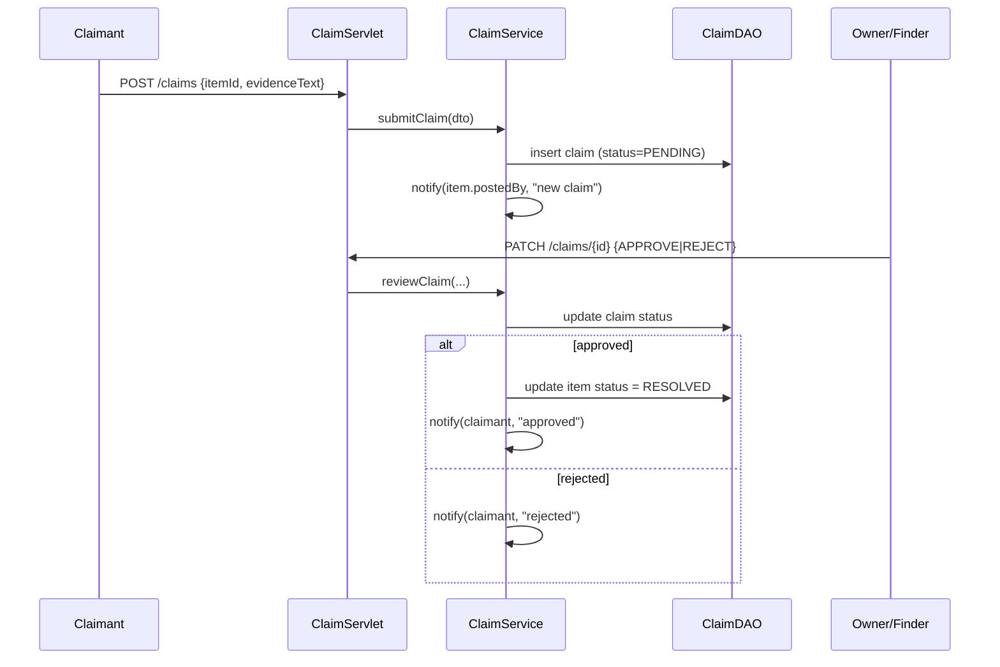
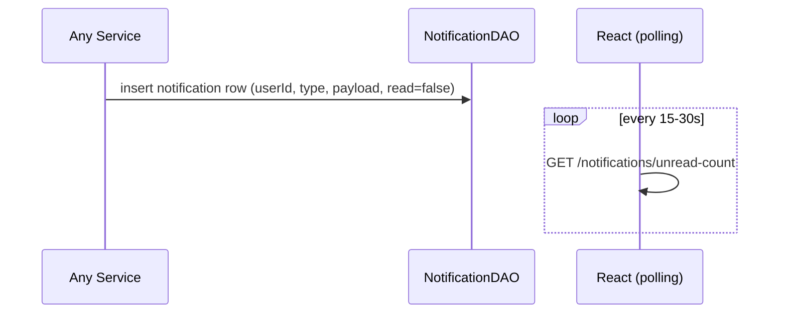
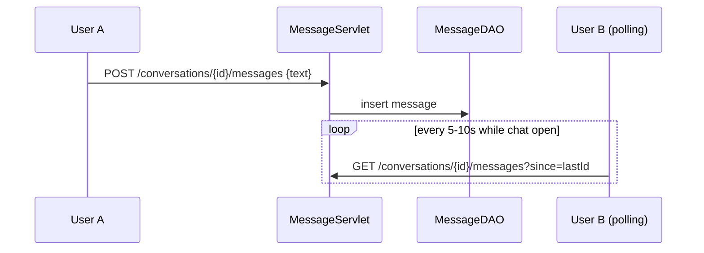
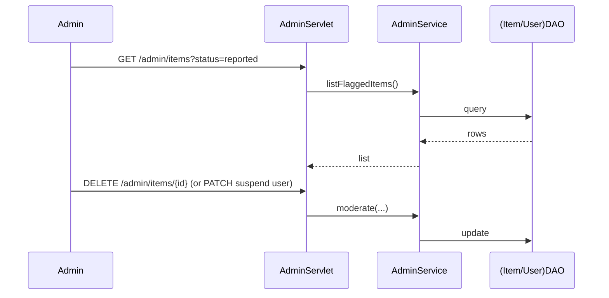
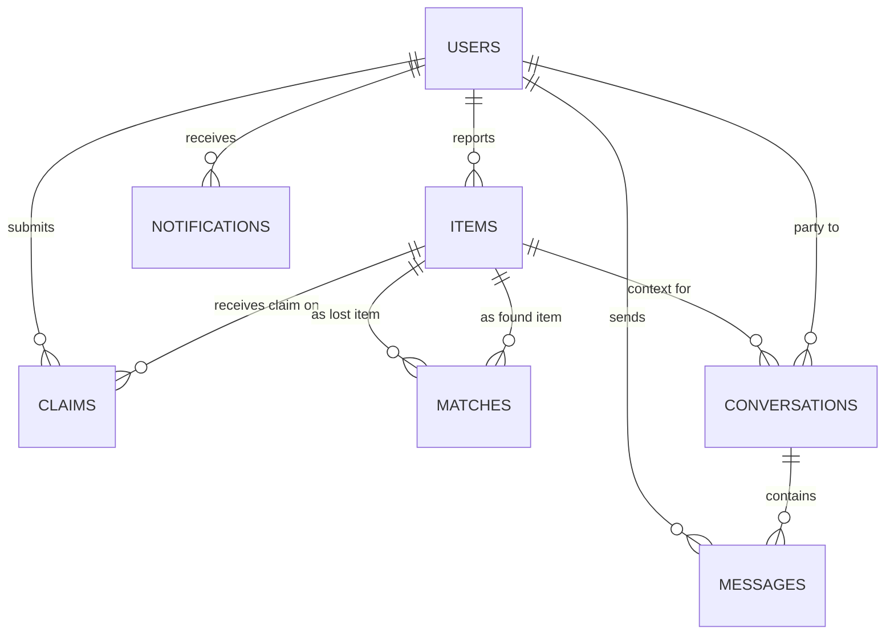

# CampusFind — Smart Campus Lost & Found Management System
## Complete Architecture & 21-Day Delivery Blueprint

**Team size:** 3 developers | **Timeline:** 21 days | **Stack:** React+Vite+Tailwind / Java Servlets+Tomcat / MySQL+JDBC / Cloudinary / Leaflet+OSM

This document is your single source of truth from Day 1 to final presentation. No code is included anywhere — only decisions, structures, flows, and schedules. Read Sections 1–6 first (architecture), then Section 21–22 (the actual day-by-day plan) before writing a single line.

---

## 1. Project Overview & Guiding Principle

CampusFind's job is to reduce the friction between "I lost something" and "someone found it." The **one feature that makes this a real project instead of a CRUD form** is Smart Matching — everything else exists to feed that engine clean data and to let humans act on its output (claim, message, notify).

**Guiding principle for all 21 days:** ship a working vertical slice before adding breadth. A user can register → post a lost item → post a found item → see a match → claim it → get approved, all before you touch messaging, ratings, or the admin dashboard's statistics page. That thin end-to-end path is your safety net. Build it in Week 1.

---

## 2. Fixed Technology Stack (confirmed, do not deviate)

| Layer | Technology | Why it's the right call for 21 days |
|---|---|---|
| Frontend | React + Vite + Tailwind + React Router + Axios | Vite's fast HMR keeps 3 people iterating without fighting tooling; Tailwind removes CSS bikeshedding under time pressure |
| Backend | Java Servlets + Apache Tomcat | Required by the college; forces you to genuinely understand HTTP request lifecycle, which is exactly what a viva panel probes |
| Data access | JDBC (no ORM) | An ORM (Hibernate) adds a second thing to debug under a deadline; raw JDBC with a thin DAO layer is fully explainable in a viva and fast enough at this data scale |
| Database | MySQL | Relational integrity (foreign keys between items/users/claims/matches) matters more here than schema flexibility |
| Image storage | Cloudinary | Free tier is generous, gives you URLs + basic transformations (resize/format) for zero server effort — critical since Tomcat is a poor place to serve/process binary files |
| Auth | JWT (stateless) | Explained in Section 13 |
| Maps | Leaflet + OpenStreetMap | Free, no API key friction, well documented, trivial to demo |
| VCS | Git + GitHub | Section 24 |
| API testing | Postman | Build a shared Postman collection from Day 3 onward — it becomes your informal API contract between frontend and backend devs |

**Explicitly rejected and why:** Spring Boot (too much magic to explain in a viva in 3 weeks; the college wants raw Servlets), microservices (network overhead and deployment complexity you cannot afford), a custom-trained ML model for image similarity (no time, no labeled dataset, no GPU budget).

---

## 3. Architectural Philosophy — Modular Monolith

One deployable Java web application (one WAR file on one Tomcat instance), internally organized into clearly separated modules so it *reads* like it has boundaries even though it ships as one unit.

**Layers, and why each exists:**

- **Servlets (Controllers):** the only layer that knows about `HttpServletRequest`/`HttpServletResponse`. Its job is purely: parse input, call a service, write output. If a servlet method is more than ~20 lines, logic has leaked into the wrong layer.
- **Services:** business rules live here. "Can this user claim this item?" "Does this match score qualify as strong?" A service never touches JDBC directly and never touches the servlet request/response objects — this is what lets you unit-test rules without spinning up Tomcat.
- **DAO/Repository:** the only layer that writes SQL and touches `Connection`/`PreparedStatement`. If tomorrow you swapped MySQL for PostgreSQL, only this layer changes.
- **Models/Entities:** plain Java objects mirroring your tables (User, Item, Match, Claim...). No behavior, just data + getters/setters.
- **Utilities:** password hashing helpers, JWT helpers, response-formatting helpers, similarity math helpers — small, stateless, reusable.
- **Middleware/Authentication filter:** a `Filter` (not a servlet) that intercepts every protected request, validates the JWT, and attaches the authenticated user to the request before it reaches a servlet. This is what stops you from writing "check token" code in 15 different servlets.
- **Matching Engine:** a dedicated service package, isolated from the rest of business logic, because it has its own internal pipeline (Section 11) and is the piece most likely to be revised repeatedly.
- **Database:** MySQL, accessed only through DAOs.

This gives you a genuine separation-of-concerns story for the viva without inventing enterprise patterns you'd need to defend (no Spring, no dependency injection framework, no annotations-driven magic — just plain Java classes calling each other).

---

## 4. Feature Triage — what to cut first if you fall behind

**MUST-HAVE (this is your MVP — build these no matter what):**
Registration/login/JWT auth, student & admin roles, report lost item, report found item, image upload via Cloudinary, item browsing with search/filter/pagination, item detail page, smart matching (even a simplified version), match confidence display, ownership claim submission, claim approve/reject, basic notification of a match/claim outcome, minimal admin dashboard (view users/items, remove listing, resolve item, review claims), responsive UI.

**SHOULD-HAVE (build only after MUST-HAVE is fully working end-to-end):**
Campus map view, location-based search, basic 1:1 messaging, duplicate-listing detection.

**NICE-TO-HAVE (cut without guilt if Day 14 arrives and MVP isn't done):**
Email notifications, advanced AI image recognition beyond the pretrained-embedding approach, analytics dashboards, real-time (WebSocket) notifications, QR codes, mobile app, ratings/reviews.

**Hard rule:** if you are behind schedule on Day 12, delete "should-have" items from the sprint board entirely rather than half-building them. A half-built messaging feature is worse for your grade and your demo than a polished MVP.

---

## 5–6. Final Recommended Architecture & Request Flow

```
                         ┌─────────────────────────┐
                         │   React (Vite) SPA      │
                         │  Pages / Components /   │
                         │  Axios API layer        │
                         └───────────┬─────────────┘
                                     │ HTTPS / REST (JSON)
                                     ▼
                         ┌─────────────────────────┐
                         │   Apache Tomcat         │
                         │  ┌───────────────────┐  │
                         │  │ Auth Filter (JWT)  │  │
                         │  └─────────┬──────────┘  │
                         │            ▼             │
                         │  ┌───────────────────┐  │
                         │  │ Servlets (Controller)│ │
                         │  └─────────┬──────────┘  │
                         │            ▼             │
                         │  ┌───────────────────┐  │
                         │  │  Service Layer      │  │
                         │  │  (incl. Matching     │ │
                         │  │   Engine module)     │ │
                         │  └─────────┬──────────┘  │
                         │            ▼             │
                         │  ┌───────────────────┐  │
                         │  │  DAO / Repository   │  │
                         │  └─────────┬──────────┘  │
                         └────────────┼─────────────┘
                                      │ JDBC
                                      ▼
                         ┌─────────────────────────┐
                         │        MySQL             │
                         └─────────────────────────┘

  External integrations (called from the Service layer):
   • Cloudinary  — image storage/transform, returns a URL persisted in MySQL
   • Leaflet/OSM — frontend-only rendering; backend just stores/returns lat-lng
   • Notification module — writes rows to a `notifications` table; frontend polls
```

**Responsibility summary:** React never talks to MySQL or Cloudinary's admin API directly for anything sensitive — it uploads images to Cloudinary using an unsigned upload preset (simplest for a student timeline) and sends the resulting URL to Java, which is the only party that writes to MySQL. Leaflet/OSM is purely a frontend rendering library; the backend's only job re: maps is storing/returning latitude/longitude and doing simple distance math.

---

## 7. Diagrams

### A. High-Level System Diagram


### B. Authentication Flow


### C. Report Lost Item Flow


### D. Report Found Item Flow
Identical shape to C, with `type:FOUND` — same servlet/service handles both, differentiated by a `type` field (do not build two separate pipelines).

### E. Smart Matching Flow


### F. Claim Flow


### G. Notification Flow


### H. Messaging Flow


### I. Admin Moderation Flow


---

## 8. Backend Architecture in Detail

**Request path example (create item):** `React → ItemServlet.doPost() → ItemService.createItem() → ItemValidator.validate() → ItemDAO.insert() → JDBC → MySQL`, then `ItemService` hands off to `MatchingEngine.triggerMatching()`.

- **Validation:** a small dedicated `Validator` per entity type (ItemValidator, UserValidator) called at the top of each Service method — required fields, string length, enum values, image URL format. Keep this centralized so the same rules apply whether input comes from the create-lost-item form or the create-found-item form.
- **Exception handling:** define a small hierarchy — `ValidationException`, `NotFoundException`, `UnauthorizedException`, `ConflictException` — thrown from Services, caught in a single place per servlet (or a shared base servlet method) and mapped to HTTP status codes (400/404/401/409) with a consistent JSON error shape `{error: "...", field: "..."}`. This one decision saves you from writing try/catch spaghetti in every servlet.
- **Matching module:** isolated package (`matching/`) containing the scoring functions, the candidate-selection query, and the orchestration class. Treat it as a "black box" the rest of the backend calls with `triggerMatching(itemId)` and nothing else needs to know its internals — this isolation is exactly what lets Developer 3 iterate on it without touching other developers' code.
- **Notification module:** dumb on purpose — just inserts rows. No SMTP, no push service, no sockets, in the MVP.

**Why this architecture suits a 3-week college project:** every layer is a plain Java class with a single, explainable responsibility; there is no framework magic to debug at 1am before a demo; and the layering gives you a genuinely defensible answer to "why did you structure it this way?" in the viva — because you can point at a concrete failure mode each layer prevents (e.g., "without the DAO layer, SQL injection risk is scattered across every servlet instead of centralized where we can consistently use prepared statements").

---

## 9. Frontend Architecture

**Conceptual folder structure:**
```
src/
  api/            → one file per resource: authApi, itemsApi, matchesApi, claimsApi,
                    notificationsApi, messagesApi, adminApi (each wraps Axios calls)
  components/     → reusable: Navbar, ItemCard, ImageUploader, MapPicker,
                    MatchBadge, ClaimForm, ProtectedRoute, AdminRoute,
                    LoadingSpinner, ErrorBanner
  pages/          → Login, Register, Home/Browse, ItemDetail, ReportLost,
                    ReportFound, MyListings, MatchesForItem, ClaimReview,
                    Notifications, Messages, AdminDashboard
  layouts/        → MainLayout (navbar+footer), AdminLayout
  context/        → AuthContext (current user, token, login/logout)
  hooks/          → useAuth, useFetch/useApi wrapper, usePagination
  utils/          → formatDate, distanceLabel, validators
```

- **Auth handling:** `AuthContext` holds the JWT + decoded user, persists the token (localStorage is acceptable for this project's threat model), and an Axios interceptor attaches `Authorization: Bearer <token>` to every request and redirects to `/login` on a 401.
- **Protected/admin routes:** a `ProtectedRoute` wrapper checks `AuthContext` before rendering; an `AdminRoute` additionally checks `role === 'ADMIN'`.
- **State management:** you do **not** need Redux/Zustand for this scope. `AuthContext` for auth, local `useState`/`useEffect` per page for server data, and a tiny custom `useApi` hook (loading/error/data pattern) is sufficient and far faster to build than introducing a global store.
- **Forms:** plain controlled components + a lightweight validation utility (or a minimal library only if a team member is already fluent in one) — do not spend a day evaluating form libraries.
- **Loading/error/empty states:** standardize once (a `LoadingSpinner`, an `ErrorBanner`, an `EmptyState` component) and reuse everywhere rather than re-deriving per page.

---

## 10. Database Architecture

### Core tables

**users** — Purpose: identity + role. Key fields: id (PK), name, email (unique), password_hash, role (STUDENT/ADMIN), reputation_score (nullable, should-have), created_at, is_suspended.

**items** — Purpose: every lost/found report. Key fields: id (PK), reporter_id (FK→users), type (LOST/FOUND), title, category, color, brand, description, image_url, location_text, latitude, longitude, event_date, status (ACTIVE/RESOLVED/REMOVED), created_at. Index on (type, category, status) for browse/filter; index on created_at for recency sorting.

**matches** — Purpose: computed pairing between a lost item and a found item. Key fields: id (PK), lost_item_id (FK→items), found_item_id (FK→items), score (decimal), sub_scores (JSON or separate columns for image/category/color/brand/text/location/date), status (SUGGESTED/DISMISSED/CONFIRMED), created_at. Unique constraint on (lost_item_id, found_item_id) to prevent duplicate rows. Index on score for ranking.

**claims** — Purpose: ownership claim on a found item (or a "this is mine" claim triggered from a match). Key fields: id (PK), item_id (FK→items), claimant_id (FK→users), evidence_text, status (PENDING/APPROVED/REJECTED), reviewed_by (FK→users, nullable), created_at, reviewed_at.

**notifications** — id (PK), user_id (FK→users), type (MATCH_FOUND/CLAIM_SUBMITTED/CLAIM_APPROVED/CLAIM_REJECTED/NEW_MESSAGE/ITEM_RESOLVED), payload (JSON: relevant ids + short text), is_read, created_at. Index on (user_id, is_read).

**conversations** — id (PK), item_id (FK→items, nullable — a conversation is usually item-scoped), user_a_id, user_b_id (both FK→users), created_at.

**messages** — id (PK), conversation_id (FK→conversations), sender_id (FK→users), text, is_read, created_at. Index on (conversation_id, created_at) for chronological fetch.

**reports** (should-have, for flagging inappropriate listings) — id (PK), item_id (FK→items), reported_by (FK→users), reason, status.

**ratings** (nice-to-have, cut if behind) — id (PK), rated_user_id, rated_by_user_id, item_id, score, comment.

### Relationships
`users (1) → (many) items`, `items (1) → (many) matches` on both sides (an item can appear as lost_item_id in some rows and found_item_id in none, or vice versa), `items (1) → (many) claims`, `users (1) → (many) notifications`, `conversations (1) → (many) messages`. All foreign keys `ON DELETE CASCADE` for child rows tied to a deleted item's lifecycle, except claims and matches which you may prefer to soft-preserve (`ON DELETE SET NULL` on item removal by admin) for audit purposes — explicitly decide and document this rather than leaving it default.

### Conceptual ER Diagram


---

## 11. Smart Matching Architecture (the centerpiece)

**1. Trigger point:** matching runs **after the item is successfully created**, not during the create request itself. Recommendation for a 21-day student project: run it **synchronously right after insert, in the same servlet call, but as the very last step** — i.e., not a true background job/queue (Kafka, RabbitMQ, a job scheduler) which is overkill and risky to debug under deadline, but also not blocking the response on it in a way the user notices. Practically: insert the item → respond to the client immediately with the created item → then, in the same server-side request thread just before returning (or via a simple `Thread`/`ExecutorService.submit()` fire-and-forget call, which is realistic and still "Java" enough to explain), run matching. This is the most realistic option: a real background task system is unnecessary complexity; doing it purely synchronously before responding adds latency the user will notice once you compare against dozens of candidates with image similarity calls.

**2. Candidate selection:** when a LOST item is created, only fetch FOUND items (and vice versa) that are `status = ACTIVE`, filtered first by **category** (cheap, high-signal, eliminates most irrelevant rows immediately) and a coarse **date window** (e.g., found_date within ±14 days of lost_date — configurable). Only run the expensive comparisons (image similarity) against this pre-filtered candidate set, not the whole table. This is what keeps you sane at "thousands of listings" scale (point 16).

**3–4. Comparison & image similarity:** do **not** train a model. Recommended practical approach: use a pretrained image embedding model via a hosted API or a small pretrained model you call from Java/via a lightweight Python microservice **only if a teammate is comfortable with it** — but the simplest path for this stack is:
- Use an existing pretrained feature-extraction approach exposed through a free/low-effort route: e.g., call an external service that returns an embedding vector for an uploaded image (several vision APIs offer this), **or**, if you want zero external dependency risk, use Cloudinary's own perceptual-hash / similarity tooling if available on your plan, **or** the simplest fallback: skip true image-embedding comparison entirely and use a basic perceptual hash (pHash) computed once at upload time and stored alongside the item — pHash can be computed via a small, well-documented algorithm and is genuinely explainable in a viva as "we compare hash similarity via Hamming distance," which is honest, cheap, and does not require an ML pipeline.
- **Recommendation:** build the matching engine so image similarity is one **pluggable sub-score function**. Start Week 1 assuming it returns a stubbed/default mid-value, get everything else (category/color/brand/text/location/date scoring + the weighted total + the UI showing "Potential Match: 92%") working first, then slot in the real pHash/embedding comparison in Week 2. This isolation is what protects your MVP if image similarity turns out harder than expected (see Risk section).

**5. Where similarity artifacts are stored:** if using pHash, store the hash string (a short fixed-length string, e.g., 64 bits) as a column on `items` at upload time — cheap, no extra table needed. If using an external embedding API, store the returned vector as a JSON column on `items` (or a separate `item_embeddings` table if you want cleaner separation) — computed once at creation, never per-comparison.

**6. Cosine similarity, conceptually:** each image (or text description) is represented as a vector of numbers. Cosine similarity measures the angle between two vectors, not their magnitude — two vectors pointing in nearly the same "direction" in that abstract feature space score close to 1 (very similar) regardless of overall brightness/size differences; unrelated images score near 0. For pHash you'd instead use Hamming distance (count of differing bits) normalized into a 0–1 similarity score — conceptually the same role, simpler math.

**7. Attribute comparison:** category = exact match (1 or 0, since "Bag" vs "Electronics" shouldn't partially match); color = exact match with a small synonym table (e.g., "black" vs "dark" treated as a partial match ~0.5) — keep this simple, a lookup table not NLP; brand = exact match (case-insensitive), with 0 if either is blank/unknown (don't penalize as "different," just contribute 0 weight — see point 14).

**8. Location proximity:** compute straight-line (Haversine) distance in meters/km between the two items' stored lat/lng, then map distance to a 0–1 score with a simple decay (e.g., same location = 1.0, decays linearly to 0 at some cutoff like 500m–1km, since a college campus is small — beyond that, extremely unlikely to be the same item).

**9. Date proximity:** compute day difference between lost_date and found_date, map to 0–1 with a similar decay (e.g., 0 days = 1.0, decaying to 0 by ~14–21 days — an item found 2 months after being lost and reported is a weak signal, though not impossible).

**10. Description/text similarity:** simplest realistic approach for 21 days — **not** a full NLP embedding pipeline. Use basic token overlap (e.g., a Jaccard similarity or simple TF-based cosine similarity over lowercase, stop-word-stripped tokens from both descriptions). This is easily implementable in plain Java with no external library and is fully explainable.

**11. Final score formula — recommended weights and why:**

| Signal | Suggested Weight | Reasoning |
|---|---|---|
| Category | 15% | Near-binary gate, already used to filter candidates, so lower weight in the final blended score to avoid double-counting its influence |
| Color | 10% | Useful but unreliable (lighting, subjective naming) |
| Brand | 10% | Strong signal when present, but frequently blank |
| Image similarity | 30% | The headline differentiator — deserves the largest single weight, but not "all or nothing" so items still surface even with a mediocre photo |
| Description text | 15% | Genuinely informative but noisy free text |
| Location | 10% | Campus is small, so a moderate signal, not decisive alone |
| Date | 10% | Same reasoning as location |

*(These sum to 100%; document in your report that weights were chosen deliberately, not arbitrarily, and are easily tunable constants in one place in the Matching Engine — that tunability itself is a good viva talking point.)*

**12–13. Ranking & threshold:** sort candidates by final score descending; only persist/show matches with score **≥ 60%** as "Potential Match" to avoid noise; label ≥ 85% as "Strong Match" in the UI (two-tier badge: e.g., green "Strong Match" vs amber "Possible Match").

**14. Missing data handling:** if an attribute is missing on either item (e.g., no brand specified), **exclude that signal from the weighted average and redistribute its weight proportionally across the remaining available signals**, rather than scoring it as 0 (which would unfairly punish honest "I don't know the brand" reporting). This is a clean, defensible rule to state in your report.

**15. Avoiding duplicate comparisons:** the unique constraint on `(lost_item_id, found_item_id)` in the `matches` table prevents duplicate rows; additionally, only ever compute a new LOST item against existing FOUND items (and vice versa) at creation time — you never need to re-diff FOUND-against-FOUND, halving your comparison space by construction.

**16. Behavior at scale (thousands of listings):** category + date-window pre-filtering (point 2) is what saves you — most real deployments would then add a spatial/vector index, but for a college project with a realistic dataset size (dozens to low hundreds of demo items), a plain SQL `WHERE category = ? AND event_date BETWEEN ? AND ? AND status='ACTIVE'` query is more than fast enough; explicitly state in your report that a production version would introduce vector indexing (e.g., approximate nearest neighbor search) for the image embeddings at larger scale, showing you understand the limitation without needing to build it.

---

## 12. Image Architecture

**Flow:** `React (file input) → direct unsigned upload to Cloudinary → Cloudinary returns secure URL (+ optionally a generated thumbnail URL via transformation params) → React sends that URL string to the Java backend as part of the item payload → Java stores the URL string (and, if using pHash, computes/stores the hash by fetching the image bytes from that URL once) → MySQL stores only the URL/hash, never binary data.`

- **Never store images in MySQL** — always URLs only.
- **File validation:** enforce on the frontend before upload (type: jpg/png/webp only; size: e.g., max 5MB) and treat Cloudinary's own upload preset restrictions as a second line of defense.
- **Compression/WebP/thumbnails:** let Cloudinary's transformation URLs handle this (e.g., append `f_auto,q_auto` and a width parameter for a thumbnail version used in list views vs. the full image on the detail page) — do not build your own image processing in Java.
- **Security:** use an **unsigned upload preset** scoped to a specific folder with restrictions (file type, max size) configured in the Cloudinary dashboard, so you don't have to expose your API secret in frontend code, and you don't have to build a signing endpoint in Java (a nice-to-have if time allows, not required for MVP).
- **Image similarity processing:** happens server-side, once, at item-creation time (Section 11), never client-side.

---

## 13. Authentication & Authorization

**JWT vs server-side sessions — recommendation: JWT.** Reasoning: Servlets have no built-in session-clustering concern here (single Tomcat instance), so either would technically work, but JWT is simpler to explain and implement cleanly with a Servlet `Filter` (no need to manage `HttpSession` state, no session-timeout config to tune), and it maps naturally onto a stateless REST API consumed by a SPA — a common, well-understood pattern that's easy to defend in a viva.

- **Registration:** validate uniqueness of email → hash password with BCrypt (never store plaintext, never roll your own hashing) → insert user with role=STUDENT by default (admin accounts are seeded manually/via a protected script, not through public registration).
- **Login:** verify email exists → `BCrypt.checkpw()` → issue JWT containing `{userId, role, exp}`, signed with a server-side secret (kept in an environment variable, never hardcoded/committed).
- **Protected APIs:** the Auth `Filter` checks the `Authorization: Bearer <token>` header on every non-public route, verifies signature + expiry, and attaches the resolved user (id/role) to the request attributes for downstream servlets/services to use.
- **Roles:** STUDENT and ADMIN encoded in the JWT payload and re-checked server-side on every admin endpoint (never trust a role claim shown only in the frontend UI).
- **Logout:** since JWT is stateless, logout is simply "frontend deletes the token" — document this honestly as a known limitation (no server-side revocation) rather than over-engineering a token blacklist for this project.
- **Token expiration:** short-to-medium lifespan (e.g., 24 hours) is sufficient; skip refresh-token complexity entirely for this timeline.

---

## 14. Claim & Ownership Verification

**Claim lifecycle:** `PENDING → APPROVED` or `PENDING → REJECTED` (terminal states; no re-opening in MVP).

- **What the claimant provides:** free-text evidence describing identifying details not visible in the public listing (e.g., "there's a torn zipper pull on the inside pocket," "the charger cable inside is red," approximate time/place lost) — a simple textarea is sufficient; you do not need a structured Q&A wizard for MVP.
- **Who reviews:** the user who **posted the found item** (or an admin, as an override/tiebreaker) reviews claims against their listing. This keeps review authority with the person who actually has the item, which is both more realistic and removes load from admins.
- **Visibility:** the claim's evidence text is visible only to the finder/reviewer and to admins — never publicly listed, and never visible to other claimants (to prevent copying another claimant's story).
- **After approval:** the item's `status` flips to `RESOLVED`, all other pending claims on that item are auto-set to `REJECTED` (with a distinct system-generated reason, e.g., "item claimed by another user"), and a notification fires to the approved claimant.
- **After rejection:** item stays `ACTIVE`/open to other claims; claimant is notified.

---

## 15. Notification Architecture

**Comparison:**
- *Polling* — simplest possible: frontend calls `GET /notifications/unread-count` (and `GET /notifications`) every ~20–30 seconds. Zero new infrastructure.
- *Server-Sent Events (SSE)* — moderately more "real-time," one-directional, works over plain HTTP, no extra library — a reasonable *stretch* upgrade if Week 3 has slack, but not MVP.
- *WebSockets/Socket.IO* — most "real," but adds a persistent-connection concern on Tomcat that's disproportionate to this project's needs and risky to debug under deadline.
- *Email* — nice-to-have; adds an SMTP dependency and failure modes (spam filters, credentials) you don't want to troubleshoot mid-deadline.

**Recommendation: plain polling for MVP.** It is trivially explainable, has zero new failure surface, and is indistinguishable from "real-time" to a viva panel watching a 5-minute demo.

---

## 16. Messaging

Keep it deliberately minimal: a `Conversation` tied to an item + two users, and `Message` rows with sender/text/timestamp/read-flag. **REST polling** (same pattern as notifications — poll `GET /conversations/{id}/messages?since=<lastMessageId>` every 5–10 seconds while the chat panel is open) rather than WebSockets, for the same reasons as Section 15. Basic security: only the two participants of a conversation may read/post to it — enforce this check in `MessageService`, not just hide it in the UI.

---

## 17. Campus Map

- **Locations represented as:** a human-readable `location_text` (e.g., "Central Library, 2nd Floor") **plus** `latitude`/`longitude` decimal columns on `items`.
- **How coordinates are stored:** plain `DECIMAL(9,6)` columns in MySQL — no need for a spatial data type (`POINT`/spatial index) at this project's scale; Haversine math in Java/SQL is fine.
- **Nearby searches:** compute Haversine distance in the query or in Java after a coarse bounding-box pre-filter (e.g., `lat BETWEEN ? AND ?`) if you want to avoid computing distance for every row.
- **Marker display:** React renders a Leaflet map with OSM tiles, plotting item markers from the fetched list; clicking a marker opens a popup linking to the item detail page.
- **Location selection when reporting an item:** either let the user click a point on an embedded Leaflet map (captures lat/lng directly) or pick from a short dropdown of predefined campus landmarks (each landmark pre-mapped to fixed lat/lng in a lookup table) — the dropdown approach is faster to build and perfectly adequate for a single-campus scope; recommend it for MVP and treat free-form map-click selection as a should-have polish item.

---

## 18. Admin Dashboard

**Admin workflow:** a dedicated `/admin` area (route-guarded by role) with: a users list (view/suspend), an items list filterable by status/flagged, a claims queue (list of PENDING claims across the whole system, in case a finder is unresponsive and an admin needs to intervene), a simple stats strip (counts: total items, active items, resolved items, pending claims — computed with a few `COUNT(*)` queries, not a dashboarding library). Admin actions (remove listing, suspend user, force-resolve item, override a claim decision) go through the same Service layer as normal user actions, just gated by a role check, so you're not duplicating business logic for the admin path.

---

## 19. API Architecture (grouped, conceptual)

**/auth** — `POST /auth/register` (public), `POST /auth/login` (public).

**/users** — `GET /users/me` (auth required — any role), `PATCH /users/me` (auth required — update own profile), `GET /users` (admin only — list all).

**/items** — `POST /items` (auth required — create lost/found report), `GET /items` (public — browse, with query params for search/filter/pagination: `?type=&category=&q=&page=&limit=`), `GET /items/{id}` (public — detail), `PATCH /items/{id}` (auth required, owner-only — edit/resolve), `DELETE /items/{id}` (auth required, owner or admin).

**/matches** — `GET /items/{id}/matches` (auth required, owner-only — see potential matches for my item).

**/claims** — `POST /claims` (auth required — submit claim), `GET /claims?itemId=` (auth required, item-owner or admin — review queue), `PATCH /claims/{id}` (auth required, item-owner or admin — approve/reject).

**/notifications** — `GET /notifications` (auth required — own notifications), `GET /notifications/unread-count` (auth required), `PATCH /notifications/{id}/read` (auth required).

**/conversations** — `GET /conversations` (auth required — my conversations), `POST /conversations` (auth required — start, tied to an item), `GET /conversations/{id}/messages` (auth required, participant-only), `POST /conversations/{id}/messages` (auth required, participant-only).

**/admin** — `GET /admin/users`, `PATCH /admin/users/{id}/suspend`, `GET /admin/items`, `DELETE /admin/items/{id}`, `GET /admin/claims`, `GET /admin/stats` — all admin-role-only.

For every endpoint: document expected request body/params, success response shape, and the specific error cases (400 validation, 401 no/invalid token, 403 wrong role/not owner, 404 not found, 409 conflict e.g. duplicate email) directly in your shared Postman collection — that collection **is** your API documentation deliverable (Section 28).

---

## 20. Security Architecture

**MUST HAVE:** password hashing (BCrypt), JWT-based authentication on all protected routes, server-side role re-verification on every admin action (never trust the frontend), input validation on every write endpoint, prepared statements everywhere (zero string-concatenated SQL — this is non-negotiable and an easy viva question), file type/size validation on upload, CORS configured to allow only your known frontend origin, secrets (DB password, JWT signing key, Cloudinary keys) in environment variables/config files excluded from Git via `.gitignore` — never hardcoded/committed.

**NICE TO HAVE:** rate limiting (a simple in-memory counter per IP on login attempts is a reasonable stretch if time allows), XSS output-encoding hardening beyond React's default escaping, more granular audit logging.

---

## 21. Phase-Based Development Plan

**PHASE 0 — Planning & Setup (Day 1)**
Objective: everyone aligned, environments ready. Deliverables: GitHub repo with branch structure, Postman workspace, agreed DB schema draft, agreed API contract draft, dev environments running (Tomcat local, MySQL local, Vite dev server). Definition of Done: all 3 devs can run both frontend and backend locally and hit a "hello world" endpoint.

**PHASE 1 — Project Foundation (Days 2–3)**
Objective: skeleton apps exist. Backend: base servlet structure, DB connection utility, exception classes, response-formatting utility. Frontend: routing skeleton, layout components, Axios instance with interceptor, Auth context skeleton. DB: create all tables from the finalized schema. Deliverable: an empty-but-running app on both ends, schema created.

**PHASE 2 — Authentication (Days 4–5)**
Objective: users can register/login and reach protected pages. Backend: AuthServlet, AuthService, UserDAO, BCrypt + JWT utilities, Auth Filter. Frontend: Register/Login pages, AuthContext wiring, ProtectedRoute. Deliverable: a real user can register, log in, and see a protected "My Listings" empty page.

**PHASE 3 — Lost & Found Core (Days 6–8)**
Objective: the heart of the app. Backend: ItemServlet/Service/DAO, image URL handling. Frontend: ReportLost/ReportFound forms (with Cloudinary unsigned upload), ItemDetail page, MyListings page. Deliverable: a user can post a lost item and a found item with an image and see them in their own list and on a public browse page (basic, unfiltered).

**PHASE 4 — Search & Discovery (Days 9–10)**
Objective: browse is genuinely usable. Backend: query params for search/category/pagination on `GET /items`. Frontend: Browse page with filters, pagination controls, search box. Deliverable: a user can search/filter across a growing item set.

**PHASE 5 — Smart Matching (Days 9–12, overlapping with Phase 4 since Dev 3 works in parallel)**
Objective: the differentiator works. Backend: MatchingEngine package — candidate selection, sub-score functions (start with image sub-score stubbed), weighted total, MatchDAO. Frontend: "Potential Matches" section on item detail / MyListings. Deliverable: creating a lost item that closely resembles an existing found item (or vice versa) produces a visible match with a score.

**PHASE 6 — Claims & Notifications (Days 12–14)**
Objective: users can act on matches. Backend: ClaimServlet/Service/DAO, NotificationDAO + insert calls wired into item/claim events. Frontend: ClaimForm, ClaimReview page (for finders), Notifications page + unread badge (polling). Deliverable: full loop closes — report → match → claim → approve/reject → notified → item resolved.

**➡ MVP CHECKPOINT: by end of Day 14, the thin end-to-end path (Section 1) must work. If it doesn't, stop adding new features and fix this first — see Section 25.**

**PHASE 7 — Map & Messaging (Days 15–16, should-have)**
Objective: polish, only if on schedule. Backend: MessageServlet/Service/DAO, ConversationDAO. Frontend: Leaflet map on Browse, MapPicker on report forms (or landmark dropdown), basic Messages page (polling). Deliverable: a map view of items; a simple chat thread per item conversation.

**PHASE 8 — Admin Dashboard (Days 17–18)**
Objective: admin can manage the platform. Backend: AdminServlet/Service covering users/items/claims/stats, role-gated. Frontend: AdminLayout + AdminDashboard pages. Deliverable: an admin account can view stats, remove a bad listing, suspend a user.

**PHASE 9 — Testing (Days 19–20)**
Objective: confidence before demo. See Section 26 for scenarios. Deliverable: a written testing report and all P0 bugs fixed.

**PHASE 10 — Deployment & Presentation (Day 21, with buffer built into Days 19–20)**
Objective: it's live and the team can explain it. Deliverable: deployed app, final report, rehearsed demo.

---

## 22. 21-Day Development Schedule

Roles referenced below: **Dev1 = Frontend**, **Dev2 = Backend/DB core**, **Dev3 = Matching/Integrations/Testing** (see Section 23 for why this split, and how it flexes).

**DAY 1**
Goals: Alignment + setup. Tasks: finalize feature list/schema/API contract together as a team; create GitHub repo, branch strategy, Postman workspace.
Dev1: scaffold Vite+React+Tailwind+Router project, push skeleton.
Dev2: scaffold Servlet/Tomcat project structure, DB connection utility, create MySQL schema (all tables from Section 10).
Dev3: research/decide the image-similarity approach (pHash vs external API) and write a one-page decision note; set up shared Postman collection shell.
Dependencies: none yet. Expected result: repo exists, schema exists, everyone can run their half locally.

**DAY 2**
Goals: Backend skeleton + frontend skeleton.
Dev1: build layout components (Navbar/Footer/MainLayout), routing skeleton with placeholder pages.
Dev2: base servlet class, exception classes, JSON response utility, JDBC utility class.
Dev3: write ItemValidator/UserValidator draft rules; start prototyping the pHash algorithm standalone (outside the app) to de-risk it early.
Dependencies: Day 1 schema. Expected result: apps boot and render/respond, no real features yet.

**DAY 3**
Goals: Auth backend begins; frontend Auth UI begins.
Dev1: Register/Login page UI (forms only, no wiring yet), AuthContext skeleton.
Dev2: UserDAO, BCrypt utility, AuthService.register()/login() logic (unit-testable without JWT yet).
Dev3: JWT utility (generate/verify), Auth Filter skeleton; continue de-risking pHash prototype.
Dependencies: Day 2 base classes. Expected result: backend can hash+verify passwords and mint tokens in isolation.

**DAY 4**
Goals: Wire authentication end-to-end.
Dev1: connect Register/Login forms to AuthApi, store token in AuthContext, build ProtectedRoute.
Dev2: AuthServlet exposing /auth/register and /auth/login, Auth Filter wired into web.xml/deployment descriptor for protected paths.
Dev3: finalize pHash prototype into a reusable utility function; write API docs for /auth in Postman.
Dependencies: Dev2's Day 3 service logic. Expected result: real registration/login working through the UI.

**DAY 5**
Goals: Auth polish + buffer.
Dev1: profile page (GET/PATCH /users/me wiring), logout, protected-route edge cases (expired token → redirect).
Dev2: /users/me endpoints, role field enforcement, seed one ADMIN account manually in DB.
Dev3: begin ItemDAO/ItemService skeleton (unblocks Phase 3 early); document Auth Filter behavior for the report.
Dependencies: none new. Expected result: Phase 2 fully closed; slight head start into Phase 3.

**DAY 6**
Goals: Item creation backend + frontend forms begin.
Dev1: ReportLost/ReportFound page UI + Cloudinary unsigned upload wiring (image → URL).
Dev2: ItemServlet POST endpoint, ItemService.createItem(), ItemDAO.insert(), ItemValidator wired in.
Dev3: MatchingEngine package skeleton — candidate selection query only (image sub-score still stubbed at a fixed value).
Dependencies: Day 5 skeletons. Expected result: an item row can be created via the API from Postman.

**DAY 7**
Goals: Connect report forms to backend; item detail page.
Dev1: wire ReportLost/Found forms to POST /items; build ItemDetail page (GET /items/{id}).
Dev2: GET /items/{id}, PATCH/DELETE /items/{id} with owner-check.
Dev3: implement category/color/brand/date/location sub-score functions with unit-style manual tests.
Dependencies: Day 6 endpoints. Expected result: a real user can post a lost item through the UI and view it.

**DAY 8**
Goals: MyListings + browse (basic).
Dev1: MyListings page, basic unfiltered Browse page (GET /items list).
Dev2: GET /items list endpoint (no filters yet), pagination fields in response shape.
Dev3: implement description text-similarity function; wire pHash into item creation (compute+store hash at insert time).
Dependencies: Day 7. Expected result: Phase 3 substantially complete — full item lifecycle visible in UI.

**DAY 9**
Goals: Search/filter/pagination; matching scoring assembly.
Dev1: filter UI (category/type dropdowns, search box) + pagination controls on Browse.
Dev2: extend GET /items with query params for search/filter/pagination server-side.
Dev3: assemble weighted final-score calculation combining all sub-scores; MatchDAO insert logic.
Dependencies: Day 8. Expected result: Browse page is genuinely usable; matching math is complete end-to-end on paper.

**DAY 10**
Goals: Trigger matching on item creation; expose matches via API.
Dev1: "Potential Matches" UI section on ItemDetail/MyListings (badge + score display).
Dev2: wire MatchingEngine.triggerMatching() call at the end of ItemService.createItem(); add GET /items/{id}/matches endpoint.
Dev3: test matching against manually seeded lost/found pairs; tune threshold/weights based on results.
Dependencies: Days 6–9 all converge here. Expected result: creating a lost item that resembles an existing found item produces a visible scored match in the UI. **This is your first major integration milestone — test it thoroughly today.**

**DAY 11**
Goals: Buffer/hardening day for matching; start claims backend.
Dev1: polish match UI (strong vs possible badge styling), start ClaimForm UI.
Dev2: ClaimDAO, ClaimService.submitClaim(), POST /claims.
Dev3: continue tuning matching accuracy against more test data; document the scoring formula for the report.
Dependencies: Day 10 milestone stable. Expected result: matching feature is demo-safe; claim submission backend exists.

**DAY 12**
Goals: Claim review + resolution logic.
Dev1: wire ClaimForm to POST /claims; build ClaimReview page for finders.
Dev2: PATCH /claims/{id} (approve/reject) including auto-reject-others-on-approve logic and item status flip to RESOLVED.
Dev3: NotificationDAO + insert-on-event wiring (match found, claim submitted, claim approved/rejected).
Dependencies: Day 11. Expected result: a claim can be submitted and approved/rejected, changing item status.

**DAY 13**
Goals: Notifications UI; MVP path testing begins.
Dev1: Notifications page + unread badge with polling.
Dev2: GET /notifications, /unread-count, PATCH /notifications/{id}/read endpoints.
Dev3: run the full MVP path (register→report→match→claim→approve→notify) end-to-end repeatedly, log every bug found.
Dependencies: Day 12. Expected result: notifications visibly appear after key events.

**DAY 14 — MVP CHECKPOINT**
Goals: Close every bug found Day 13; freeze MVP scope.
All three devs: triage and fix bugs from Dev3's Day 13 test log, in priority order (blocking > major > minor).
Dependencies: Day 13 test log. Expected result: the full MUST-HAVE feature set works reliably, start to finish, without manual workarounds. **If this checkpoint is not met, do not proceed to Phase 7/8 — extend bugfixing into Day 15 and cut should-have scope instead (see Section 25).**

**DAY 15**
Goals: (If Day 14 checkpoint passed) Map integration.
Dev1: Leaflet + OSM map on Browse page; MapPicker or landmark dropdown on report forms.
Dev2: ensure lat/lng persisted correctly from report forms; add basic distance-based sort/filter param to GET /items.
Dev3: incorporate location sub-score fully (if not already) using real coordinates instead of placeholder data; regression-test matching.
Dependencies: MVP checkpoint. Expected result: items visible on a map; location genuinely factors into matching.

**DAY 16**
Goals: Basic messaging.
Dev1: Messages page/thread UI wired to polling endpoints.
Dev2: ConversationDAO/MessageDAO, POST/GET conversation+message endpoints with participant checks.
Dev3: security-test messaging (can user A read user B's private conversation? verify 403).
Dependencies: Day 15. Expected result: two users can message each other about an item.

**DAY 17**
Goals: Admin dashboard backend + UI skeleton.
Dev1: AdminLayout + AdminDashboard page shell, users/items/claims list views.
Dev2: AdminServlet/AdminService — list users/items/claims, stats queries.
Dev3: write admin-role-bypass security tests (can a STUDENT hit /admin endpoints? verify 403).
Dependencies: none new (independent of Phases 5–7). Expected result: an admin can view platform data.

**DAY 18**
Goals: Admin actions.
Dev1: wire suspend-user, remove-item, force-resolve-item, override-claim buttons.
Dev2: corresponding PATCH/DELETE admin endpoints, all going through existing Services with a role gate.
Dev3: full regression pass across all features after all Phase 7/8 additions; log bugs.
Dependencies: Day 17. Expected result: admin moderation loop complete; full feature set frozen.

**DAY 19**
Goals: Testing day 1 (see Section 26 for scenarios).
All three devs: execute the test plan systematically — Dev1 frontend/UX pass, Dev2 API/security pass (Postman collection run-through), Dev3 matching-accuracy + end-to-end pass. Fix P0/P1 bugs same-day.
Dependencies: Day 18 feature freeze. Expected result: a written bug list, most already resolved.

**DAY 20**
Goals: Testing day 2 + deployment.
Morning: finish remaining bug fixes from Day 19.
Afternoon: deploy (Section 27) — Dev2 leads Tomcat/backend + MySQL deployment, Dev1 leads frontend static hosting + env config, Dev3 does a full smoke test against the deployed URLs.
Dependencies: Day 19 fixes. Expected result: a live, publicly reachable deployment that passes the same smoke test as local.

**DAY 21**
Goals: Documentation finalization + presentation rehearsal.
All three devs: finish README/setup docs/API docs/ER diagram export/final report (Section 28); rehearse the demo script and viva Q&A (Section 29) at least twice as a team.
Dependencies: Day 20 deployment. Expected result: team is ready to present.

---

## 23. Team Division

**Dev1 — Frontend/React.** Owns everything under `src/pages`, `src/components`, `src/api` wiring, and UX polish. Never blocked waiting on backend beyond Day 1–2, because API contracts are agreed on Day 1 and Postman stubs let Dev1 build against a known shape even before Dev2 finishes an endpoint.

**Dev2 — Java Backend/MySQL core.** Owns Servlets/Services/DAOs for Auth, Items, Claims, Notifications, Conversations, Admin, and the schema itself. This is the heaviest single load, so Dev3's early days (1–5) deliberately front-load matching *research and de-risking* rather than matching *implementation*, freeing Dev3 to pick up secondary backend endpoints (e.g., ItemDAO skeleton on Day 5, ClaimDAO on Day 11) when Dev2 would otherwise be a bottleneck.

**Dev3 — Matching Engine/Integrations/Testing.** Owns the entire `matching/` package, Cloudinary integration decisions, the pHash/image-similarity approach specifically, and becomes the team's primary tester from Day 13 onward (since they understand the full data model best, having built the engine that reads from every table).

**Coordination:** a 15-minute daily standup (even async in a chat if schedules conflict) covering "what I finished / what I'm doing today / what's blocking me." The Postman collection and the agreed API contract (locked on Day 1, amendments require a quick team sync) are what let Dev1 and Dev2 work in parallel without waiting on each other's exact implementation.

---

## 24. Git & GitHub Workflow

- **Repository:** one monorepo with `/frontend` and `/backend` top-level folders (simpler than two repos for a 3-person, 3-week project — one PR can touch both sides when needed for an integration change).
- **Branches:** `main` (always deployable), `dev` (integration branch), and short-lived `feature/<short-name>` branches per task (e.g., `feature/claim-review-ui`), branched from `dev`, merged back via PR.
- **Pull requests:** every feature branch → PR into `dev`, reviewed by at least one other teammate before merge (even a quick skim) — this catches integration mismatches early rather than at Day 20.
- **Commit conventions:** simple prefix convention — `feat:`, `fix:`, `refactor:`, `docs:`, `test:` — enough structure to make history readable without ceremony.
- **Issue tracking:** use GitHub Issues mapped to the phases in Section 21 (one issue per feature, e.g., "Phase 3: Report Lost Item form"), assigned to the owning dev, closed via the merging PR.
- **Milestones:** create a GitHub Milestone per Phase (0–10) with a due date matching the schedule in Section 22, so progress is visible at a glance.
- **Merge to `main`:** only at agreed checkpoints (end of Phase 6/MVP, and again before Day 20 deployment) — not continuously — so `main` always reflects a demo-safe state.

---

## 25. MVP Definition

**MUST HAVE (the project is not gradeable without these):** registration/login/JWT, report lost item, report found item, image upload, browse with basic search/filter, item detail, smart matching with a visible confidence score, claim submission, claim approve/reject with item status change, basic notification of key events, minimal admin (view + remove/resolve + suspend).

**SHOULD HAVE:** campus map, location-based sort/filter, basic messaging, duplicate detection.

**STRETCH:** email notifications, real-time (SSE/WebSocket) notifications, ratings/reviews, analytics, QR codes, mobile app.

**The stop-adding-features line:** the instant Day 14's MVP checkpoint (Section 22) is not fully green, **freeze scope immediately** — no should-have work begins until every must-have item works end-to-end without manual database edits or developer intervention. If Day 16 arrives and MVP still isn't rock-solid, cut straight to Section 26 testing with whatever should-have features are already done, and explicitly mark unfinished should-haves as "future work" in your final report rather than shipping them half-broken.

---

## 26. Testing Strategy

**Backend API testing:** run the full Postman collection against every endpoint — happy path + at least one failure case each (missing field → 400, no token → 401, wrong role → 403, non-existent id → 404).

**Frontend testing:** manual click-through of every page in both a logged-out and logged-in (student + admin) state; verify protected routes actually redirect; verify loading/error/empty states render (e.g., temporarily disconnect the backend to see the error state).

**Database testing:** verify foreign key constraints actually reject orphaned inserts; verify cascade/set-null behavior on deletes matches what you documented in Section 10.

**Authentication testing:** expired token is rejected; tampered token (change one character) is rejected; wrong password is rejected with a generic error (not "email exists but password wrong" — avoid leaking which part failed).

**Matching algorithm testing:** seed at least 5 deliberately-similar lost/found pairs and 5 deliberately-dissimilar pairs; confirm similar pairs score high and dissimilar pairs score low or don't appear; test missing-attribute handling (item with no brand shouldn't be unfairly scored).

**Image upload testing:** oversized file is rejected client-side; wrong file type is rejected; a successful upload's URL actually resolves to the image.

**Claim testing:** a second claim on an already-resolved item is blocked or clearly flagged; approving one claim auto-rejects the others on that item.

**Security testing:** a STUDENT token cannot hit any `/admin/*` endpoint (expect 403); a user cannot PATCH/DELETE another user's item; a non-participant cannot read a private conversation.

**End-to-end testing:** the full MVP path (Section 1) run start-to-finish by someone who did *not* build that particular feature, at least twice, on both local and the deployed environment.

---

## 27. Deployment Architecture

Because the backend is Java Servlets on Tomcat (not Node), pick hosts that explicitly support a WAR/Tomcat runtime rather than typical Node-oriented PaaS defaults.

- **Frontend hosting:** Vercel or Netlify (free tier) — build the Vite app to static assets and deploy; configure the API base URL via an environment variable pointing at your backend's public URL.
- **Java/Tomcat backend hosting:** look at student-friendly options that support a Java/Tomcat runtime directly — a small VM (a free-tier cloud VM where you install Tomcat yourself) is the most reliable and most *explainable* option for a viva ("we deployed our WAR to a Tomcat instance running on a Linux VM"), since many "one-click" PaaS platforms are Node/Python-first and awkward for a raw Servlet WAR. Confirm current free-tier availability before Day 20 — verify with a quick search closer to deployment day since free-tier offerings change.
- **MySQL hosting:** a managed free-tier MySQL instance (several cloud providers offer one) — keep credentials in environment variables, never in committed config.
- **Cloudinary:** already cloud-hosted; just ensure your unsigned upload preset and cloud name are configured as frontend environment variables (upload preset names are not secret; do not expose your API *secret* anywhere in frontend code).
- **CORS:** configure your Servlet filter/response headers to allow only your deployed frontend's exact origin (not `*`) once you know the final frontend URL.
- **Environment variables:** DB URL/credentials, JWT signing secret, Cloudinary cloud name/upload preset — all externalized, none committed to Git.

*(Note: exact current free-tier hosting options for Java/Tomcat and MySQL change over time — confirm what's actually available and student-friendly a few days before Day 20 rather than locking in a specific provider name this early in the plan.)*

---

## 28. Documentation Deliverables

- **Project README** — setup instructions, tech stack, how to run locally.
- **System architecture document** — pulled largely from Sections 5–9 of this blueprint, adapted with your final decisions.
- **ER diagram** — export the Mermaid diagram (Section 10) or redraw cleanly for the report.
- **API documentation** — your maintained Postman collection, exported.
- **Database documentation** — table-by-table purpose/fields/constraints (Section 10 content, filled in with final types).
- **Setup instructions** — step-by-step for a grader to run the project locally.
- **User manual** — screenshots + short descriptions of each user-facing flow.
- **Testing report** — the scenarios from Section 26 plus actual results/bugs found and fixed.
- **Final project report** — combines all of the above into the college's required report format.

---

## 29. Viva/Presentation Preparation

For each of these, be ready to state **what it is, why you used it, how it works, and why not the alternative**:

- **Java Servlets** — raw HTTP request/response handling without a framework; chosen because the college requires Java and because it forces (and demonstrates) genuine understanding of the servlet lifecycle, versus Spring Boot's auto-configuration hiding that lifecycle.
- **Apache Tomcat** — the servlet container that actually runs your WAR; know the request lifecycle (container receives request → maps to servlet via URL pattern → filter chain runs → servlet executes).
- **JDBC** — direct database access without an ORM; chosen for transparency (every SQL statement is visible and explainable) over Hibernate's generated queries, appropriate at this project's scale.
- **MySQL** — relational integrity for genuinely relational data (users/items/matches/claims all reference each other).
- **REST API** — stateless, resource-oriented endpoints consumed by a decoupled frontend.
- **React** — component-based SPA, chosen for its ecosystem and team familiarity.
- **Authentication (JWT)** — stateless token carrying identity+role, verified per-request by a Filter.
- **Smart matching** — be ready to walk through the exact weighted-scoring pipeline (Section 11) end to end; this will likely be your most-probed topic.
- **Image similarity** — explain honestly which approach you used (pHash/Hamming distance, or an external embedding API/cosine similarity) and why you chose it over training a custom model (no labeled dataset, no time, no infrastructure).
- **Cloudinary** — offloads binary storage/transformation from your own server.
- **Location-based search** — Haversine distance over stored lat/lng.
- **Database relationships** — be able to draw the ER diagram from memory and explain every foreign key.

**Likely viva questions:** "Why didn't you use Spring Boot?" / "How does your matching algorithm handle an item with no photo?" / "What happens if two people claim the same item at the same time?" / "How do you prevent SQL injection?" / "Why JWT instead of sessions?" / "What would you change for 100,000 users?" — prepare one crisp answer for each, in advance, as a team.

---

## 30. Risk & Contingency Plan

| Risk | Probability | Impact | Prevention | Fallback |
|---|---|---|---|---|
| Image similarity takes too long to implement well | High | Medium | Stub it with a fixed placeholder value from Day 1 of matching work (Day 6) so the rest of the pipeline never blocks on it; prototype pHash standalone on Day 1–3, outside the app, before integrating | Ship with pHash/Hamming-distance-only image scoring (simple, explainable, honest) rather than any embedding-API dependency; explicitly document this choice as a deliberate scope decision, not a failure |
| Java/Tomcat deployment problems | Medium | High | Do a throwaway "hello world" WAR deployment to your chosen host in Week 1 (not Day 20) to surface platform quirks early | Fall back to running the backend on a plain VM with Tomcat manually installed, which you fully control |
| Cloudinary issues (quota, preset misconfig) | Low | Medium | Test the unsigned upload preset end-to-end on Day 1–2, not Day 6 | Fall back to storing a direct image URL from any static host / even a placeholder image set for demo purposes |
| Database problems (schema drift between devs) | Medium | Medium | Lock schema on Day 1, changes require a team sync + a single person applying migrations | Keep a single canonical `schema.sql` file in the repo, re-runnable from scratch at any time |
| Integration conflicts (frontend/backend contract mismatch) | Medium | Medium | Lock the API contract on Day 1, maintain the shared Postman collection as the source of truth | Daily standups catch drift early; a quick 10-minute contract-review sync if a mismatch is found |
| Authentication bugs | Low | High | Test auth thoroughly on Days 4–5 before building anything on top of it | Because Auth is foundational and built early (Phase 2), there's schedule slack to fix it before Phase 3 depends on it |
| Matching algorithm accuracy is poor/confusing in demo | Medium | Medium | Seed realistic test data early (Day 10) and tune weights/threshold against it repeatedly through Day 15 | Curate your live demo's seed data in advance so the demonstrated matches are clean and convincing — this is standard, honest practice for a student demo |
| General time shortage | High | High | The entire phase/day plan is sequenced so MUST-HAVE finishes by Day 14 with SHOULD-HAVE as pure upside afterward | Section 25's scope-freeze rule: cut should-have/stretch features without hesitation rather than let them threaten MVP polish or testing time |

---

## 31. Final Architecture Summary

**Frontend:** React + Vite + Tailwind + React Router + Axios — a single SPA, statically hosted.
**Backend:** Java Servlets on Apache Tomcat, layered into Servlet/Service/DAO/Model/Utility/Filter/Matching modules — one deployable WAR.
**Database:** MySQL via JDBC, ~9 core tables (users, items, matches, claims, notifications, conversations, messages, reports, ratings).
**Storage:** Cloudinary for all images, URLs only in MySQL.
**Matching:** synchronous-at-creation-time weighted scoring across image (pHash/Hamming or external embedding + cosine), category, color, brand, description text, location (Haversine), and date proximity, with missing-data-aware weight redistribution.
**Maps:** Leaflet + OpenStreetMap, lat/lng stored as decimal columns.
**Authentication:** stateless JWT verified by a Servlet Filter, with BCrypt password hashing.
**Deployment:** static frontend host (Vercel/Netlify) + a Tomcat-capable backend host + managed MySQL, all wired via environment variables and locked-down CORS.

**Final feature list to actually build in 21 days:** every MUST-HAVE item in Section 25, plus as many SHOULD-HAVE items (map, location search, basic messaging) as Days 15–18 allow, with all STRETCH items explicitly deferred to a documented "future work" section in your final report.

---

## 32. Implementation Checklist (use as your project tracker)

**Phase 0 — Setup**
- [ ] GitHub repo created with `/frontend` + `/backend` structure
- [ ] Branch strategy set up (`main`, `dev`)
- [ ] Postman workspace created
- [ ] Final schema agreed
- [ ] Final API contract agreed
- [ ] Local dev environments running for all 3 devs

**Phase 1 — Foundation**
- [ ] React+Vite+Tailwind+Router skeleton pushed
- [ ] Servlet base structure + DB connection utility
- [ ] Exception classes + response utility
- [ ] All MySQL tables created from schema

**Phase 2 — Authentication**
- [ ] BCrypt + JWT utilities
- [ ] AuthService register/login logic
- [ ] Auth Filter wired to protected routes
- [ ] Register/Login pages wired end-to-end
- [ ] ProtectedRoute + AuthContext working
- [ ] Admin account seeded

**Phase 3 — Lost & Found Core**
- [ ] Cloudinary unsigned upload preset configured
- [ ] ReportLost / ReportFound forms wired
- [ ] ItemServlet/Service/DAO complete (CRUD)
- [ ] ItemDetail page
- [ ] MyListings page

**Phase 4 — Search & Discovery**
- [ ] Search/filter/pagination on GET /items (backend)
- [ ] Filter UI + pagination controls (frontend)

**Phase 5 — Smart Matching**
- [ ] Candidate selection query (category + date window)
- [ ] Image sub-score function (pHash or chosen approach)
- [ ] Category/color/brand/text/location/date sub-score functions
- [ ] Weighted final score + missing-data handling
- [ ] MatchDAO + trigger wired into item creation
- [ ] "Potential Matches" UI with score badges
- [ ] Matching accuracy tuned against seeded test pairs

**Phase 6 — Claims & Notifications**
- [ ] ClaimServlet/Service/DAO (submit + review)
- [ ] Auto-reject-other-claims-on-approve logic
- [ ] Item status flips to RESOLVED on approval
- [ ] NotificationDAO + event-triggered inserts
- [ ] Notifications page + polling unread badge
- [ ] **MVP checkpoint passed end-to-end**

**Phase 7 — Map & Messaging**
- [ ] Leaflet + OSM map on Browse
- [ ] Location picker (map-click or landmark dropdown) on report forms
- [ ] Location sub-score using real coordinates
- [ ] ConversationDAO/MessageDAO
- [ ] Messaging UI with polling

**Phase 8 — Admin Dashboard**
- [ ] AdminServlet/Service (users/items/claims/stats)
- [ ] Admin route guard on frontend
- [ ] Suspend user / remove item / force-resolve / claim override actions wired

**Phase 9 — Testing**
- [ ] Full Postman run-through (happy + failure paths)
- [ ] Frontend click-through in all roles/states
- [ ] Security tests (role bypass, ownership checks, private conversation access)
- [ ] Matching accuracy tests
- [ ] End-to-end MVP path tested by a non-author, twice
- [ ] Written testing report completed

**Phase 10 — Deployment & Presentation**
- [ ] Frontend deployed (static host)
- [ ] Backend WAR deployed to Tomcat-capable host
- [ ] Managed MySQL provisioned and connected
- [ ] CORS locked to production frontend origin
- [ ] Environment variables set on both hosts, none committed to Git
- [ ] Smoke test passed on deployed environment
- [ ] README, architecture doc, ER diagram, API docs, DB docs, user manual, testing report, final report all completed
- [ ] Demo script + viva Q&A rehearsed as a team

---

*End of blueprint. Treat Section 22 as your literal daily standup agenda, and Section 25's scope-freeze rule as the single most important sentence in this document if the schedule slips.*
